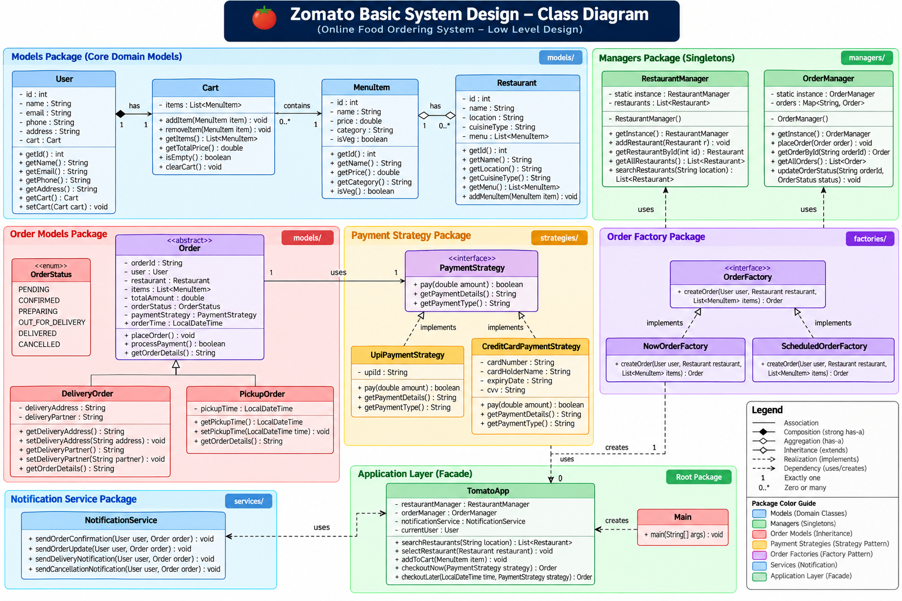
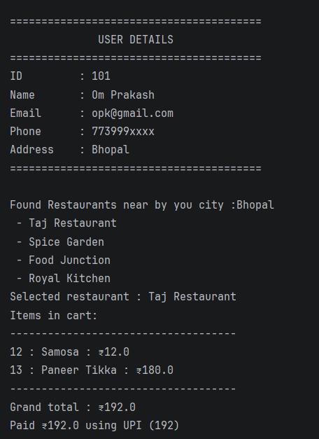
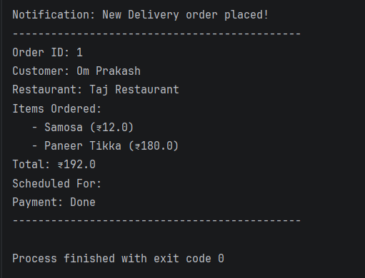

# 🍅 Zomato Basic System Design

A beginner-friendly **Online Food Ordering System** built with Java to practically understand **OOP, SOLID principles, UML, Low-Level Design (LLD), and Design Patterns**.

This project simulates a basic food-ordering workflow where a user can search for restaurants, select a restaurant, add menu items to a cart, place an order, process payment, and receive an order notification.

---

## 📌 Project Overview

The main purpose of this project was not to build a production-ready food delivery application, but to understand how software design concepts work together in a real Java application.

### Concepts implemented

- Object-Oriented Programming
- SOLID Principles
- UML Class Diagrams
- Low-Level Design
- Strategy Pattern
- Factory Pattern
- Singleton Pattern
- Composition & Association
- Inheritance & Polymorphism
- Separation of Responsibilities

---

## 🏗️ System Architecture

> Add your class diagram image as `docs/class-diagram.png` in the repository.

<p align="center">
  
</p>

The system is divided into different components such as:

- Models
- Managers
- Factories
- Payment Strategies
- Services
- Application Layer

---

## 📐 Class Diagram

<p align="center">
  
</p>

The major relationships include:

```text
User
 │
 └── Cart
      │
      └── MenuItems

Restaurant
 │
 └── MenuItems

Order
 ├── DeliveryOrder
 └── PickupOrder

PaymentStrategy
 ├── UpiPaymentStrategy
 └── CreditCardPaymentStrategy

OrderFactory
 ├── NowOrderFactory
 └── ScheduledOrderFactory
```

---

## 🧩 Design Patterns Used

### 1. Strategy Pattern

Used for handling different payment methods.

```text
             PaymentStrategy
                   │
          ┌────────┴────────┐
          ↓                 ↓
     UPI Payment       Credit Card
```

Implemented using:

- `PaymentStrategy`
- `UpiPaymentStrategy`
- `CreditCardPaymentStrategy`

The Strategy Pattern allows the payment behavior to be changed without tightly coupling the order system to a specific payment method.

---

### 2. Factory Pattern

Used for creating different types of orders.

```text
              OrderFactory
                   │
          ┌────────┴────────┐
          ↓                 ↓
   NowOrderFactory   ScheduledOrderFactory
```

Implemented using:

- `OrderFactory`
- `NowOrderFactory`
- `ScheduledOrderFactory`

This separates object creation logic from the main application flow.

---

### 3. Singleton Pattern

Used for manager classes that maintain shared application data.

```text
RestaurantManager
        │
        └── Single Instance

OrderManager
        │
        └── Single Instance
```

Implemented using:

- `RestaurantManager`
- `OrderManager`

---

## 🔄 Application Flow

```text
User
 ↓
Search Restaurants
 ↓
Select Restaurant
 ↓
View Menu
 ↓
Add Items to Cart
 ↓
Checkout
 ↓
Create Order
 ↓
Select Payment Strategy
 ↓
Process Payment
 ↓
Send Notification
 ↓
Order Completed
```

---

## 📦 Main Components

### 👤 User

Stores user information such as:

- ID
- Name
- Email
- Phone
- Address
- Cart

A user has a cart.

---

### 🍽️ Restaurant

Stores:

- Restaurant ID
- Name
- Location
- Cuisine
- Menu

A restaurant contains multiple menu items.

---

### 🛒 Cart

Responsible for:

- Adding menu items
- Removing menu items
- Calculating total price
- Clearing the cart

---

### 🍔 MenuItem

Represents an individual food item with information such as:

- ID
- Name
- Price
- Category
- Vegetarian status

---

### 📦 Order

Represents an order placed by the user.

The system supports:

- Delivery Order
- Pickup Order

---

### 💳 Payment

Payment processing is abstracted using the Strategy Pattern.

Currently supported:

- UPI
- Credit Card

---

### 🔔 Notification Service

Responsible for sending notifications related to:

- Order confirmation
- Order updates
- Delivery notifications
- Cancellation notifications

---

## 📁 Project Structure

```text
ZomatoBasicSystemDesign/
│
├── models/
│   ├── User.java
│   ├── Restaurant.java
│   ├── MenuItem.java
│   ├── Cart.java
│   ├── Order.java
│   ├── DeliveryOrder.java
│   └── PickupOrder.java
│
├── factories/
│   ├── OrderFactory.java
│   ├── NowOrderFactory.java
│   └── ScheduledOrderFactory.java
│
├── managers/
│   ├── RestaurantManager.java
│   └── OrderManager.java
│
├── strategies/
│   ├── PaymentStrategy.java
│   ├── UpiPaymentStrategy.java
│   └── CreditCardPaymentStrategy.java
│
├── services/
│   └── NotificationService.java
│
├── utils/
│   └── TimeUtils.java
│
├── TomatoApp.java
└── Main.java
```

---

## 🖥️ Sample Output

### User & Restaurant Selection

<p align="center">
  
</p>

```text
========================================
              USER DETAILS
========================================

ID       : 101
Name     : Om Prakash
Email    : opk@gmail.com
Phone    : 773999xxxx
Address  : Bhopal

========================================

Found Restaurants near by your city : Bhopal

- Taj Restaurant
- Spice Garden
- Food Junction
- Royal Kitchen

Selected restaurant : Taj Restaurant

Items in cart:

--------------------------------
12 : Samosa       : ₹12.0
13 : Paneer Tikka : ₹180.0
--------------------------------

Grand total : ₹192.0

Paid ₹192.0 using UPI (192)
```

### Order Confirmation

<p align="center">
  
</p>

```text
Notification: New Delivery order placed!

----------------------------------------

Order ID    : 1
Customer    : Om Prakash
Restaurant  : Taj Restaurant

Items Ordered:
    - Samosa (₹12.0)
    - Paneer Tikka (₹180.0)

Total       : ₹192.0
Scheduled For:
Payment     : Done

----------------------------------------
Process finished with exit code 0
```

---

## 🧠 What I Learned

This project helped me understand that design patterns are not just concepts to memorize.

I learned how to apply them to solve actual design problems:

**Strategy Pattern**

> Encapsulate interchangeable behavior.

**Factory Pattern**

> Separate object creation from object usage.

**Singleton Pattern**

> Provide a single shared instance where appropriate.

I also practiced converting a **UML design into actual Java classes and relationships**.

---

## 🛠️ Tech Stack

- Java
- OOP
- SOLID Principles
- UML
- Low-Level Design
- Design Patterns

---

## ▶️ How to Run

### Requirements

- Java JDK 8 or above
- IntelliJ IDEA / VS Code / Eclipse

Clone the repository:

```bash
git clone https://github.com/opsomewhere/Projects.git
```

Navigate to:

```text
Projects/SystemDesignProject/ZomatoBasicSystemDesign
```

Open the project in your preferred Java IDE and run:

```text
Main.java
```

---

## 🔮 Future Improvements

Some improvements I would like to explore in future versions:

- Database integration
- REST APIs
- User authentication
- Real payment gateway integration
- Order tracking
- Restaurant management
- Admin dashboard
- Better exception handling
- Unit testing
- Concurrency handling
- Caching
- Scalable backend architecture

---

## 🎯 Purpose

This project is part of my journey toward learning **Low-Level Design and System Design**.

The goal was to move from:

> **"I know the definition of a design pattern."**

to:

> **"I can apply the design pattern in a working project."**

---

## 👨‍💻 Author

**Om Prakash**

B.Tech Computer Science & Engineering Student

Java • DSA • Web Development • Low-Level Design

---

⭐ If you find this project useful, feel free to explore the code and give it a star!
